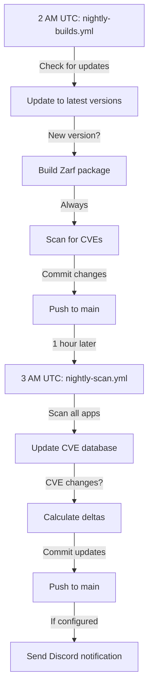

# GitHub Actions Workflows

This directory contains automated workflows for managing the D0S catalog.

## Workflows

### 🔨 `nightly-builds.yml`
**Schedule:** Daily at 2 AM UTC

Updates apps to latest versions and builds Zarf packages.

**Actions:**
- Checks for new upstream chart versions
- Updates `manifest.json` with new versions
- Scans images for CVEs
- Builds and pushes Zarf packages to OCI registry
- Commits changes to catalog

**Trigger:** 
- Scheduled (nightly)
- Manual dispatch

---

### 🔍 `nightly-scan.yml`
**Schedule:** Daily at 3 AM UTC (after builds)

Scans the entire catalog for CVE updates using the latest vulnerability database.

**Actions:**
- Runs `d0s internal scan-catalog` on all apps
- Updates CVE counts in `manifest.json` and `grype.json` files
- Calculates CVE deltas (new/resolved vulnerabilities)
- Sends Discord notifications with summary
- Commits CVE database updates

**Trigger:**
- Scheduled (nightly)
- Manual dispatch

**Environment Variables:**
- `DISCORD_WEBHOOK_URL` (secret) - Optional Discord webhook for notifications

---

### 📝 `refresh-catalog.yml`
**Schedule:** Manual trigger only

Refreshes the catalog index from all app manifests.

---

### ➕ `add-new-app.yml`
**Schedule:** Manual trigger only

Scaffolds a new app in the catalog.

---

### 🔧 `manual-build.yml`
**Schedule:** Manual trigger only

Builds a specific app on demand.

---

## D0S Internal Commands Used

The workflows use d0s internal commands for automation:

### `d0s internal scan-version`
Scans a specific app/provider/version for CVEs.

```bash
d0s internal scan-version \
  --app nginx \
  --provider docker \
  --version 1.21.0 \
  --catalog-path ./catalog
```

### `d0s internal scan-app`
Scans all versions of a single app.

```bash
d0s internal scan-app \
  --app nginx \
  --catalog-path ./catalog \
  --parallel 2 \
  --output json
```

### `d0s internal scan-catalog`
Scans the entire catalog in parallel.

```bash
d0s internal scan-catalog \
  --catalog-path ./catalog \
  --parallel 4 \
  --output json
```

### `d0s internal notify`
Sends notifications to Discord (or other webhooks).

```bash
d0s internal notify \
  --webhook-url "$DISCORD_WEBHOOK_URL" \
  --type catalog \
  --input scan-results.json
```

Auto-detection also works:
```bash
cat scan-results.json | d0s internal notify --webhook-url "$DISCORD_WEBHOOK_URL" --type auto
```

---

## Workflow Sequence



---

## Setup Instructions

### 1. Install d0s CLI (in workflow)

The workflows automatically build and install d0s:

```yaml
- name: Checkout d0s CLI repository
  uses: actions/checkout@v4
  with:
    repository: d0s-dev/d0s
    ref: alpha-release
    path: d0s-repo

- name: Build and install d0s CLI
  run: |
    cd d0s-repo
    make build-cli
    sudo mv d0s /usr/local/bin/d0s
    d0s version
```

### 2. Configure Discord Notifications (Optional)

1. Create a Discord webhook in your server:
   - Server Settings → Integrations → Webhooks → New Webhook
   - Copy the webhook URL

2. Add to GitHub repository secrets:
   - Settings → Secrets and variables → Actions → New repository secret
   - Name: `DISCORD_WEBHOOK_URL`
   - Value: `https://discord.com/api/webhooks/YOUR_WEBHOOK_ID/YOUR_TOKEN`

### 3. Configure Repository Permissions

Ensure the workflow has write permissions:
- Settings → Actions → General → Workflow permissions
- Select "Read and write permissions"
- Enable "Allow GitHub Actions to create and approve pull requests" (optional)

---

## Testing Workflows

### Test Full Catalog Scan

```bash
# Trigger manually
gh workflow run nightly-scan.yml
```

### Test Single App Scan

```bash
# Scan a specific app
gh workflow run nightly-scan.yml -f send_notification=false
```

### View Workflow Results

```bash
# List recent runs
gh run list --workflow=nightly-scan.yml --limit 5

# View details
gh run view <run-id>

# View logs
gh run view <run-id> --log
```

---

## Output Structure

### Scan Output JSON

The `scan-catalog` command produces JSON like:

```json
{
  "total_apps": 6,
  "successful_scans": 5,
  "failed_scans": 1,
  "skipped_scans": 0,
  "duration": "5m30s",
  "total_cve_delta": {
    "before": { "critical": 5, "high": 10, "medium": 20, "low": 30 },
    "after": { "critical": 6, "high": 9, "medium": 21, "low": 29 },
    "new": { "critical": 1, "high": 0, "medium": 1, "low": 0 },
    "resolved": { "critical": 0, "high": 1, "medium": 0, "low": 1 },
    "changed": true
  },
  "app_results": [
    {
      "app": "nginx",
      "status": "success",
      "versions_scanned": 3,
      "successful": 3,
      "failed": 0,
      "skipped": 0,
      "cve_delta": { ... }
    }
  ]
}
```

### Discord Notification

The notification includes:
- 📊 Scan summary with app counts
- ✅/❌ Success/failure statistics
- 🔍 CVE delta breakdown (new vs resolved)
- 🔴🟡🟠⚪ Color-coded severity indicators
- 📈 Current total CVE counts
- ⏱️ Scan duration

---

## Troubleshooting

### Workflow fails with "d0s: command not found"

The d0s CLI build step failed. Check:
- Go version is 1.23+
- d0s repository is accessible
- Build succeeded without errors

### No Discord notifications

Check:
- `DISCORD_WEBHOOK_URL` secret is set correctly
- Webhook URL is valid and active
- Workflow has `send_notification: true` (default for scheduled runs)

### CVE data not updating

Check:
- SBOM files exist in version directories
- Grype database can be downloaded (network access)
- Previous grype.json files are being backed up correctly

### Permission denied when committing

Check:
- Workflow has write permissions enabled
- `GITHUB_TOKEN` has proper scopes
- No branch protection rules blocking automated commits

---

## Maintenance

### Update d0s CLI Version

The workflows use the `alpha-release` branch by default. To update:

```yaml
- name: Checkout d0s CLI repository
  uses: actions/checkout@v4
  with:
    repository: d0s-dev/d0s
    ref: main  # or specific version tag
    path: d0s-repo
```

### Adjust Scan Parallelism

For faster scans on larger catalogs:

```yaml
d0s internal scan-catalog \
  --catalog-path . \
  --parallel 8  # increase based on available resources
```

### Change Scan Schedule

Edit the cron expression:

```yaml
schedule:
  - cron: '0 3 * * *'  # 3 AM UTC daily
  # - cron: '0 3 * * 0'  # 3 AM UTC on Sundays only
  # - cron: '0 */6 * * *'  # Every 6 hours
```

---

## Next Steps

- [ ] Add support for scanning specific providers (not just vendor)
- [ ] Implement CVE threshold checks (fail on critical CVEs)
- [ ] Add Slack/Teams notification support
- [ ] Create weekly summary reports
- [ ] Add metrics tracking over time
